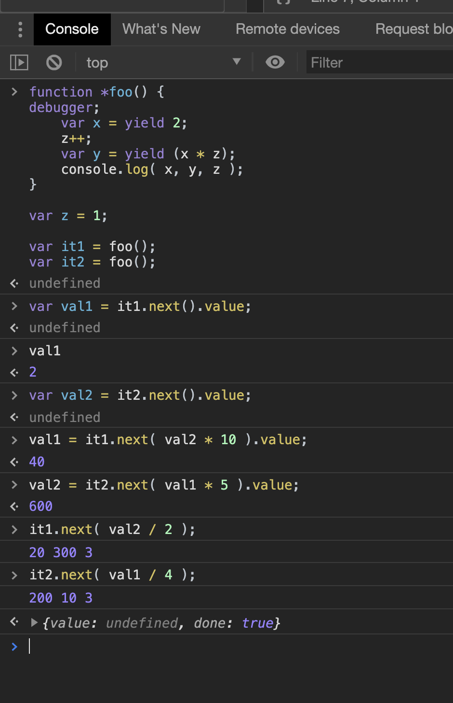

## Generators

* expressing async flow control in a sequential, synchronous-looking fashion.

* **Breaking Run-to-Completion** ES6 introduces a new type of function that does not behave with the run-to-completion behavior. This new type of function is called a generator.

Consider the following example to see how the control passes to bar function

    var x = 1;
    function foo() {
        x++;
        bar();              // <-- what about this line?
        console.log( "x:", x );
    }
    function bar() {
        x++;
    }
    foo();                  // x: 3

In preemptive multithreaded languages, it would essentially be possible for bar() to interrupt and run at exactly the right moment between those two statements. But JS is not preemptive, nor is it (currently) multithreaded. And yet, a cooperative form of this interruption (concurrency) is possible, if foo() itself could somehow indicate a pause at that part in the code.

    var x = 1;
    function *foo() {
        x++;
        yield; // pause!
        console.log( "x:", x );
    }
    function bar() {
        x++;
    }

Here is how we can yield the function 

    // construct an iterator `it` to control the generator
    var it = foo();

    // start `foo()` here!
    it.next();
    x;                      // 2
    bar();
    x;                      // 3
    it.next()               // 3

* The it = foo() operation does not execute the *foo() generator yet, but it merely constructs an iterator that will control its execution. 
* The first it.next() starts the *foo() generator, and runs the x++ on the first line of *foo().
* *foo() pauses at the yield statement, at which point that first it.next() call finishes. At the moment,moment, *foo() is still running and active, but it’s in a paused state.  
* We inspect the value of x, and it’s now 2.  We call bar(), which increments x again with x++.  
* We inspect the value of x again, and it’s now 3.
* The final it.next() call resumes the *foo() generator from where it was paused, and runs the console.log(..) statement, which uses the current value of x of 3.

**A generator is a special kind of function that can start and stop one or more times, and doesn’t necessarily ever have to finish.**

A generator function is a special function with the new processing model we just alluded to. But it’s still a function, which means it still has some basic tenets that haven’t changed — namely, that it still accepts arguments (aka input), and that it can still return a value (aka output).

    function *foo(x,y) {
        return x * y;
    }
    var it = foo( 6, 7 );
    var res = it.next();
    res.value;

    it.next()
    {value: 42, done: true}

The result of that next(..) call is an object with a value property on it holding whatever value (if anything) was returned from *foo(..). In other words, yield caused a value to be sent out from the generator during the middle of its execution, kind of like an intermediate return.

    function *foo(x) {
        var y = x * (yield "Hello");    // <-- yield a value!
        return y;
    }
    var it = foo( 6 ); // this stores the value of x
    var res = it.next();    // first `next()`, don't pass anything
    res.value;              // "Hello"
    res = it.next( 7 );     // pass `7` to waiting `yield`
    res.value;              // 42

messages can go in both directions — yield .. as an expression can send out messages in response to next(..) calls, and next(..) can send values to a paused yield expression.

yield .. and next(..) pair together as a two-way message passing system during the execution of the generator.

Consider this:

    var res = it.next();    // first `next()`, don't pass anything
    res.value;              // "Hello"
    res = it.next( 7 );     // pass `7` to waiting `yield`
    res.value;

* We don’t pass a value to the first next() call, and that’s on purpose. Only a paused yield could accept such a value passed by a next(..), and at the beginning of the generator when we call the first next(), there is no paused yield to accept such a value. The specification and all compliant browsers just silently discard anything passed to the first next(). It’s still a bad idea to pass a value, as you’re just creating silently failing code that’s confusing. So, always **start a generator with an argument-free next().**

* when there’s no more yield statements left to answer, The return statement answers the question!
* And if there is no return in your generator — return is certainly not any more required in generators than in regular functions — there’s always an assumed/implicit return; (aka return undefined;), which serves the purpose of default answering the question posed by the final it.next(7) call.

The two-way message passing with yield and next(..) — are quite powerful, but it’s not obvious at all how these mechanisms are connected to async flow control.

### Multiple Iterators

can have multiple instances of the same generator running at the same time, and they can even interact:

with generators, clearly interleaving (even in the middle of statements!) is possible:

excercise this exaample:
    var a = 1;
    var b = 2;

    function *foo() {
        a++;
        yield;
        b = b * a;
        a = (yield b) + 3;
    }

    function *bar() {
        b--;
        yield;
        a = (yield 8) + b;
        b = a * (yield 2);
    }

Define a step function

    function step(gen) {
        var it = gen();
        var last;

        return function() {
            // whatever is `yield`ed out, just
            // send it right back in the next time!
            last = it.next( last ).value;
        };
    }

    // make sure to reset `a` and `b`
    a = 1;
    b = 2;

    var s1 = step( foo );
    var s2 = step( bar );

    // run `*foo()` completely first
    s1();
    s1();
    s1();
    // now run `*bar()`
    s2();
    s2();
    s2();
    s2();

    console.log( a, b );

Try changing the order of s1 and s2. make sure we can call s1 three times (as foo has 2 yield) and s2 four time.

### Producer and iterators

producer function using the concept closures

    var gimmeSomething = (function(){
        var nextVal;
        return function(){
            if (nextVal === undefined) {
                nextVal = 1;
            }
            else {
                nextVal = (3 * nextVal) + 6;
            }
            return nextVal;
        };
    })();

The nextVal computation logic here could have been simplified, but conceptually, we don’t want to calculate the next value (aka nextVal) until the next gimmeSomething() call happens, because in general that could be a resource-leaky design for producers of more persistent or resource-limited values than simple numbers.

The **Symbol.iterator** well-known symbol specifies the default iterator for an object. Used by for...of.